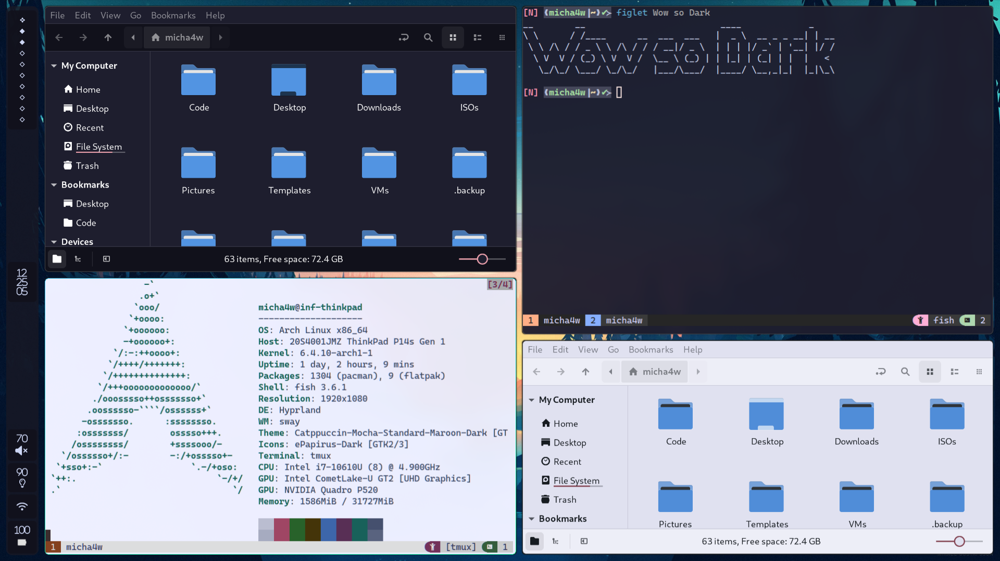

# Hypr-DarkWindow

Hyprland plugin that adds possibility to modify the fragment shader of a specific windows.



> [!IMPORTANT]
> The main branch is always up to date with Hyprlands main branch,
> if you are using a release version of Hyprland check the Readme of the specific tag.


## Shaders

There are few shaders already included in this plugin.
All of them get loaded with the plugin, if you want to only load specific ones you can limit the shaders that are loaded.

```ini
plugin:darkwindow:load_shaders = invert,tint # defaults to 'all'
plugin:darkwindow:load_shaders = # dont load any default shaders
```

| **Name**   | **Description**                                                                                              |
| ---------- | ------------------------------------------------------------------------------------------------------------ |
| **invert** | _No uniforms_ <br> Applies smart color inversion                                                             |
| **tint**   | <ul><li>_tintStrength_ = `float` (0-1) </li><li>_tintColor_ = `vec3`</li></ul> Tints the Window <br> |
| **chromakey**   | <ul> <li>_bkg_ = `vec3` <br> The background color of the Window </li> <li>_similarity_ = `float` <br> How many similar colors should be affected</li> <li>_amount_ = `float` <br> How much similar colors should be changed</li> <li>_targetOpacity_ = `float` <br> Target opacity for similar colors</li> </ul> Applies opacity changes to pixels similar to one color <br> |

Feel free to make a pull request if you want to add more shaders ([look here](./src/State.h#204)).

## Configuration

> [!IMPORTANT]
> BREAKING:
> - WindowRules `invertwindow` and `shadewindow` were removed, use `darkwindow:shade [invert]` instead
> - Shader definition was moved from `darkwindow:shader` to `plugin:darkwindow:shader`
>
> Deprecated:
> - Dispatchers `invert[active]window` and `shade[active]window` will be removed soon, use `darkwindow:shade[active] [invert]` instead

> [!NOTE]
> You can only have one shader applied at the same time.
> Applying a shader to a window which already has one applied will override the first one.

```ini
# hyprland.conf

plugin:darkwindow {
  # To modify the uniforms of an already existing shader, create a new shader and set the uniforms you want
  shader[tintRed] {
      from = tint
      args = tintColor=[1 0 0] tintStrength=0.1
  }

  # Use a custom shader from a file, check out ./src/WindowShader.cpp:7 to see examples for the files content
  shader[cool] {
      path = /path/to/shader.glsl
      args = wow=[1.0 0 0]
      introduces_transparency = true # if you modify the alpha value make sure to set this value to true so hyprland knows it should enable blur
  }
}

# Then to apply the shader to a window you can use window rules
windowrule = darkwindow:shade invert, match:class (pb170.exe)
# Uniforms can also be passed on the fly, but make sure to not use commas inside the arrays
windowrule = darkwindow:shade tint tintColor=[0 1 0], match:fullscreen true

# Or use a dispatcher
bind = $mainMod, T, darkwindow:shadeactive, tint tintColor=[0 0.5 1] tintStrength=0.3
# There is also a `darkwindow:shade WINDOW_REGEX SHADER_NAME` available (see window in https://wiki.hypr.land/Configuring/Dispatchers/#parameter-explanation)
```

## Installation

### hyprpm
```sh
hyprpm add https://github.com/micha4w/Hypr-DarkWindow
hyprpm enable Hypr-DarkWindow
hyprpm reload
```

### NixOS (home-manager)
You should already have a fully working home-manager setup before adding this plugin.
```nix
#flake.nix
inputs = {
    home-manager = { ... };
    hyprland = { ... };
    ...
    hypr-darkwindow = {
      url = "github:micha4w/Hypr-DarkWindow/tags/v0.36.0"; # Make sure to change the tag to match your hyprland version
      inputs.hyprland.follows = "hyprland";
    };
};

outputs = {
  home-manager,
  hypr-darkwindow,
  ...
}: {
  ... = {
    home-manager.users.micha4w = {
      wayland.windowManager.hyprland.plugins = [
        hypr-darkwindow.packages.${pkgs.system}.Hypr-DarkWindow
      ];
    };
  };
}
```
