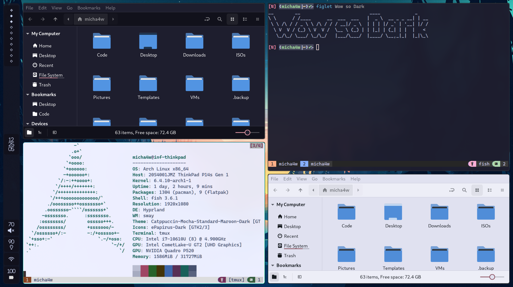

# Hypr-DarkWindow
Hyprland plugin that adds possibility to apply a shader to specific windows.



## Configuration
You first need to add the shaders you want to use to your config file, like so:

```conf
# Predefined shader with no uniforms
darkwindow:shader[invert] {
    name = invert
}

# Predefined shader with uniforms
darkwindow:shader[tintRed] {
    name = tint
    args = tintColor=[1 0 0] tintFactor=0.1
}

darkwindow:shader[tintBlue] {
    name = tint
    args = tintColor=[0 0 1] tintFactor=0.1
}

# Shader with custom path and uniforms
darkwindow:shader[cool] {
    path = /path/to/shader.glsl
    args = wow=[1.0 0 0]
}
```

Then you can use one of the 2 dispatches `shadewindow WINDOW SHADER_NAME` and `shadeactivewindow SHADER_NAME` to apply the shader to a Window.

Or you can use windowrulev2 lines:
```conf
windowrulev2 = plugin:shadewindow:invert,class:(pb170.exe)
windowrulev2 = plugin:shadewindow:tintRed,fullscreen:1
```

> [!NOTE]
> You can only have one shader applied at the same time.

## Installation

### Hyprland >= v0.36.0
We now support Nix, wooo!

You should already have a fully working home-manager setup before adding this plugin.
```nix
#flake.nix
inputs = {
    home-manager = { ... };
    hyprland = { ... };
    ...
    hypr-darkwindow = {
      url = "github:micha4w/Hypr-DarkWindow/tags/v0.36.0";
      inputs.hyprland.follows = "hyprland";
    };
};

outputs = {
  home-manager,
  hypr-darkwindow,
  ...
}: {
  ... = {
    home-manager.users.micha4w = {
      wayland.windowManager.hyprland.plugins = [
        hypr-darkwindow.packages.${pkgs.system}.Hypr-DarkWindow
      ];
    };
  };
}
```

> [!NOTE]
> In this example `inputs.hypr-darkwindow.url` sets the tag, Make sure that tag matches your Hyprland version.


### Hyprland >= v0.34.0
Install using `hyprpm`
```sh
hyprpm add https://github.com/micha4w/Hypr-DarkWindow
hyprpm enable Hypr-DarkWindow
hyprpm reload
```

### Hyprland >= v0.28.0
Installable using [Hyprload](https://github.com/duckonaut/hyprload)
```toml
# hyprload.toml
plugins = [
  "micha4w/Hypr-DarkWindow",
]
```
